# TRƯỜNG ĐẠI HỌC CÔNG NGHỆ GIAO THÔNG VẬN TẢI

## KHOA CÔNG NGHỆ THÔNG TIN

<br>

<div align="center">

# BÀI TẬP LỚN

## `<TÊN MÔN HỌC>`

<br>

## Đề tài

# XÂY DỰNG HỆ THỐNG QUẢN LÝ NHẬP VẬT LIỆU CÔNG TRƯỜNG TÍCH HỢP NHẬN DẠNG BIỂN SỐ XE

</div>

<br>

**Giảng viên hướng dẫn:** `<Cập nhật tên giảng viên>`

**Nhóm thực hiện:** `<Cập nhật tên nhóm>`

**Lớp:** `<Cập nhật lớp>`

**Nhóm:** `<Cập nhật số nhóm>`

<br>

<div align="center">

**Hà Nội - 2026**

</div>

---

# BẢNG PHÂN CÔNG CÔNG VIỆC

| STT | Thành viên | Chương 1 | Chương 2 | Chương 3 | Cài đặt hệ thống | Kiểm thử | Ghi chú |
|---:|---|:---:|:---:|:---:|:---:|:---:|---|
| 1 | `<Thành viên 1>` | x | x |  | x |  | Cập nhật sau |
| 2 | `<Thành viên 2>` |  | x | x |  | x | Cập nhật sau |
| 3 | `<Thành viên 3>` | x |  | x | x |  | Cập nhật sau |
| 4 | `<Thành viên 4>` |  | x |  | x | x | Cập nhật sau |
| 5 | `<Thành viên 5>` | x |  | x |  | x | Cập nhật sau |

---

# MỤC LỤC

- [DANH MỤC HÌNH ẢNH](#danh-mục-hình-ảnh)
- [DANH MỤC BẢNG](#danh-mục-bảng)
- [MỞ ĐẦU](#mở-đầu)
- [TỔNG QUAN CHỨC NĂNG PYTHON DETECT BIỂN SỐ XE](#tổng-quan-chức-năng-python-detect-biển-số-xe)
- [CHƯƠNG 1. XÁC ĐỊNH YÊU CẦU](#chương-1-xác-định-yêu-cầu)
  - [1.1. Giới thiệu sơ bộ](#11-giới-thiệu-sơ-bộ)
  - [1.2. Mô tả bài toán](#12-mô-tả-bài-toán)
  - [1.3. Yêu cầu chức năng và phi chức năng](#13-yêu-cầu-chức-năng-và-phi-chức-năng)
  - [1.4. Ưu nhược điểm của hệ thống cũ](#14-ưu-nhược-điểm-của-hệ-thống-cũ)
  - [1.5. Dự kiến hệ thống mới](#15-dự-kiến-hệ-thống-mới)
  - [1.6. Lập kế hoạch thực hiện](#16-lập-kế-hoạch-thực-hiện)
- [CHƯƠNG 2. PHÂN TÍCH HỆ THỐNG](#chương-2-phân-tích-hệ-thống)
  - [2.1. Phân tích hệ thống về chức năng](#21-phân-tích-hệ-thống-về-chức-năng)
  - [2.2. Phân tích hệ thống về hành vi](#22-phân-tích-hệ-thống-về-hành-vi)
  - [2.3. Phân tích lớp và dữ liệu](#23-phân-tích-lớp-và-dữ-liệu)
- [CHƯƠNG 3. THIẾT KẾ CHI TIẾT](#chương-3-thiết-kế-chi-tiết)
  - [3.1. Thiết kế tổng thể](#31-thiết-kế-tổng-thể)
  - [3.2. Thiết kế chi tiết](#32-thiết-kế-chi-tiết)
  - [3.3. Thiết kế giao diện](#33-thiết-kế-giao-diện)
  - [3.4. Thiết kế chương trình](#34-thiết-kế-chương-trình)
  - [3.5. Triển khai và vận hành](#35-triển-khai-và-vận-hành)
- [KẾT LUẬN](#kết-luận)

---

# DANH MỤC HÌNH ẢNH

| Mã hình | Tên hình |
|---|---|
| Hình 0.1 | Quy trình cải thiện OCR từ Roboflow sang YOLO tự train |
| Hình 0.2 | Luồng xử lý ảnh trong Python OCR API |
| Hình 1.1 | Lịch trình thực hiện dự án |
| Hình 2.1 | UseCase tổng quát hệ thống |
| Hình 2.2 | Biểu đồ trình tự ghi nhận chuyến xe có OCR |
| Hình 2.3 | Biểu đồ trình tự quản lý danh mục |
| Hình 2.4 | Biểu đồ trình tự xem báo cáo tổng quan |
| Hình 2.5 | Biểu đồ hoạt động ghi nhận chuyến xe |
| Hình 2.6 | Biểu đồ hoạt động kiểm tra và xác nhận OCR |
| Hình 2.7 | Biểu đồ trạng thái chuyến xe vật liệu |
| Hình 2.8 | Biểu đồ lớp nghiệp vụ chính |
| Hình 3.1 | Biểu đồ triển khai hệ thống |
| Hình 3.2 | Biểu đồ thành phần hệ thống |
| Hình 3.3 | Sơ đồ cơ sở dữ liệu vật lý |
| Hình 3.4 | Luồng xử lý OCR biển số xe |

---

# DANH MỤC BẢNG

| Mã bảng | Tên bảng |
|---|---|
| Bảng 0.1 | Các model OCR/detect được sử dụng |
| Bảng 0.2 | Các file Python chính trong chức năng detect biển số |
| Bảng 1.1 | Yêu cầu chức năng của hệ thống |
| Bảng 1.2 | Yêu cầu phi chức năng của hệ thống |
| Bảng 1.3 | Kế hoạch thực hiện dự án |
| Bảng 1.4 | Công cụ sử dụng |
| Bảng 2.1 | Xác định tác nhân và UseCase |
| Bảng 2.2 | Đặc tả UseCase quản lý công trình |
| Bảng 2.3 | Đặc tả UseCase quản lý vật tư |
| Bảng 2.4 | Đặc tả UseCase quản lý nhà cung cấp |
| Bảng 2.5 | Đặc tả UseCase lập kế hoạch nhập vật liệu |
| Bảng 2.6 | Đặc tả UseCase ghi nhận chuyến xe |
| Bảng 2.7 | Đặc tả UseCase nhận dạng biển số xe |
| Bảng 2.8 | Đặc tả UseCase xem báo cáo tổng quan |
| Bảng 2.9 | Danh sách lớp thực thể |
| Bảng 3.1 | Thiết kế bảng projects |
| Bảng 3.2 | Thiết kế bảng materials |
| Bảng 3.3 | Thiết kế bảng suppliers |
| Bảng 3.4 | Thiết kế bảng import_plans |
| Bảng 3.5 | Thiết kế bảng material_trips |
| Bảng 3.6 | Danh sách API chính |
| Bảng 3.7 | Danh sách module chương trình |

---

# MỞ ĐẦU

Trong hoạt động thi công xây dựng, việc quản lý vật liệu nhập vào công trường có ảnh hưởng trực tiếp đến tiến độ, chi phí và khả năng kiểm soát thất thoát. Ở nhiều công trường, thông tin chuyến xe, nhà cung cấp, khối lượng vật liệu, biển số xe và chứng từ nhập hàng vẫn được ghi nhận thủ công bằng giấy tờ hoặc bảng tính rời rạc. Cách làm này dễ phát sinh sai sót, khó tổng hợp theo thời gian thực và không thuận tiện khi cần đối soát giữa kế hoạch nhập vật liệu với lượng vật liệu thực tế đã vào công trường.

Đề tài “Xây dựng hệ thống quản lý nhập vật liệu công trường tích hợp nhận dạng biển số xe” được thực hiện nhằm giải quyết bài toán trên bằng một ứng dụng web có backend, frontend, cơ sở dữ liệu và dịch vụ OCR biển số. Hệ thống cho phép quản lý công trình, danh mục vật tư, nhà cung cấp, kế hoạch nhập vật liệu, từng chuyến xe nhập vật liệu, đồng thời hỗ trợ nhận dạng biển số từ ảnh xe bằng pipeline YOLO/Roboflow/Gemini. Kết quả OCR được lưu kèm chuyến xe để phục vụ xác nhận, tra cứu và kiểm toán dữ liệu.

Dự án hiện tại trong repo `dhtx-xulyanh1` gồm ba khối chính: Python OCR API xử lý ảnh biển số, NestJS backend cung cấp API nghiệp vụ và React frontend dùng Ant Design để thao tác dữ liệu. Ngoài ra, hệ thống có cấu hình Docker Compose để triển khai PostgreSQL, pgAdmin, OCR API, backend và frontend trong cùng một môi trường.

---

# TỔNG QUAN CHỨC NĂNG PYTHON DETECT BIỂN SỐ XE

Phần Python detect biển số là chức năng quan trọng nhất của đề tài, vì đây là điểm giúp hệ thống khác với một phần mềm CRUD thông thường. Mục tiêu của phần này là nhận ảnh xe đầu vào, xác định vị trí biển số, cắt vùng biển số, đọc từng ký tự, sắp xếp ký tự đúng thứ tự và chuẩn hóa thành chuỗi biển số Việt Nam.

## 0.1. Bối cảnh xây dựng chức năng OCR

Ban đầu, hệ thống sử dụng dataset và model có sẵn từ Roboflow để phát hiện biển số và đọc ký tự. Cách này giúp triển khai nhanh vì không cần tự chuẩn bị dữ liệu ngay từ đầu. Tuy nhiên, khi thử với tập ảnh thực tế trong dự án, model Roboflow phát hiện được ít ảnh hơn mong muốn. Một số ảnh có biển số nhỏ, nghiêng, mờ, thiếu sáng, bị che một phần hoặc góc chụp không giống dữ liệu mẫu nên kết quả thường rơi vào các trường hợp: không detect được vùng biển số, crop sai vùng biển, OCR không ra ký tự hoặc đọc sai format biển số Việt Nam.

Vì vậy, hướng xử lý của dự án được thay đổi theo vòng lặp cải thiện dữ liệu. Các ảnh khó được đưa vào nhóm `input-not-detect/` và `input-not-detect-2/`, sau đó được gán nhãn bằng `labelImg` theo định dạng YOLO. Dữ liệu gán nhãn này được dùng để train lại model YOLO cho hai bài toán riêng:

- Detect vùng biển số xe trên ảnh xe đầy đủ.
- Detect từng ký tự trên ảnh crop biển số.

Sau khi có model tự train, pipeline hiện tại ưu tiên chạy YOLO local để chủ động hơn, nhanh hơn và không phụ thuộc hoàn toàn vào API bên ngoài. Roboflow và Gemini vẫn được giữ lại làm fallback trong trường hợp OCR chính bị rỗng, sai format hoặc confidence thấp.

**Hình 0.1. Quy trình cải thiện OCR từ Roboflow sang YOLO tự train**

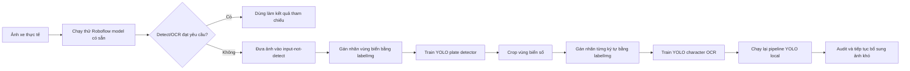

## 0.2. Các model được sử dụng

**Bảng 0.1. Các model OCR/detect được sử dụng**

| Model | Vị trí | Vai trò | Cách sử dụng trong hệ thống |
|---|---|---|---|
| `yolov8n.pt` | Root project | Model YOLO nền | Dùng làm model khởi tạo để train detector biển số và detector ký tự. |
| `models/plate_detector.pt` | `models/` | Model detect biển số phiên bản cũ | Được giữ làm model dự phòng/fallback khi cần so sánh hoặc chạy lại pipeline cũ. |
| `models/plate_detector_v2.pt` | `models/` | Model YOLO detect vùng biển số sau khi train thêm | Là detector chính trong Python OCR API hiện tại. Model nhận ảnh xe đầy đủ và trả bounding box biển số. |
| `models/char_detector.pt` | `models/` | Model YOLO detect ký tự biển số | Là OCR chính trong pipeline hiện tại. Model nhận ảnh crop biển số và trả danh sách box ký tự. |
| `license-plate-recognition-rxg4e/4` | Roboflow | Model detect vùng biển số có sẵn | Dùng khi chọn `detect_engine=roboflow` hoặc làm phương án tham chiếu ban đầu. |
| `license-plate-ocr-hugcj/3` | Roboflow | Model OCR ký tự có sẵn | Dùng khi chọn `ocr_engine=roboflow` hoặc làm fallback khi YOLO OCR rỗng/sai format. |
| `gemini-2.5-flash` | Gemini API | OCR dạng vision fallback | Dùng làm final fallback khi các OCR trước đó không cho kết quả đạt format biển số Việt Nam. |

Trong cấu hình API hiện tại, `api_server.py` mặc định dùng:

```text
detect_engine = yolo
ocr_engine = yolo
plate_model = models/plate_detector_v2.pt
char_model = models/char_detector.pt
fallback_ocr = roboflow
final_fallback_ocr = gemini
```

Điều này có nghĩa là hệ thống sẽ ưu tiên model đã tự train trong project. Chỉ khi kết quả YOLO có vấn đề, pipeline mới gọi Roboflow hoặc Gemini để hỗ trợ.

## 0.3. Quy trình train lại bằng YOLO và labelImg

Quy trình cải thiện model được thực hiện theo hai lớp dữ liệu.

Thứ nhất là lớp detect vùng biển số. Với các ảnh Roboflow không nhận ra hoặc nhận sai vùng biển, người thực hiện copy ảnh vào `input-not-detect/`, mở `labelImg`, chọn format YOLO và dùng class `plate` để vẽ box quanh toàn bộ vùng biển số. Sau đó script `scripts/dataset/split_yolo_dataset.py` tạo dataset YOLO tại `data/plate_detection/`. File cấu hình train là `config/train/plate_yolo.yaml`; model tốt nhất sau khi train được copy sang `models/plate_detector_v2.pt`.

Thứ hai là lớp OCR ký tự. Sau khi có label vùng biển, script `scripts/dataset/crop_plates_from_yolo.py` cắt biển số thành ảnh crop và lưu vào `data/char_detection/raw_crops/`. Người thực hiện tiếp tục dùng `labelImg` để vẽ box từng ký tự trên ảnh crop. Ví dụ biển số `89CD-002.13` chỉ label các ký tự `8 9 C D 0 0 2 1 3`, không label dấu `-` và dấu `.` vì phần định dạng sẽ do code xử lý. Dataset ký tự được tạo ở `data/char_detection/`, cấu hình train là `config/train/char_yolo.yaml`, model tốt nhất được copy sang `models/char_detector.pt`.

Các class ký tự trong model OCR gồm chữ số `0` đến `9` và các chữ cái hợp lệ thường gặp trên biển số Việt Nam như `A, B, C, D, E, F, G, H, K, L, M, N, P, Q, S, T, U, V, X, Y`. Việc tách riêng bài toán detect biển và detect ký tự giúp pipeline dễ kiểm soát hơn: nếu vùng biển crop đúng thì model ký tự chỉ cần tập trung vào đọc chữ/số trên vùng nhỏ, thay vì đọc trực tiếp từ toàn bộ ảnh xe.

## 0.4. Luồng xử lý ảnh trong Python OCR API

Python OCR API được cài đặt trong `api_server.py`, cung cấp endpoint `POST /detect`. Backend NestJS gửi ảnh lên endpoint này bằng multipart field `image`. API sẽ lưu ảnh vào thư mục `uploads/`, gọi `LicensePlatePipeline`, lưu ảnh kết quả vào `output/api/` và trả JSON cho backend.

**Hình 0.2. Luồng xử lý ảnh trong Python OCR API**

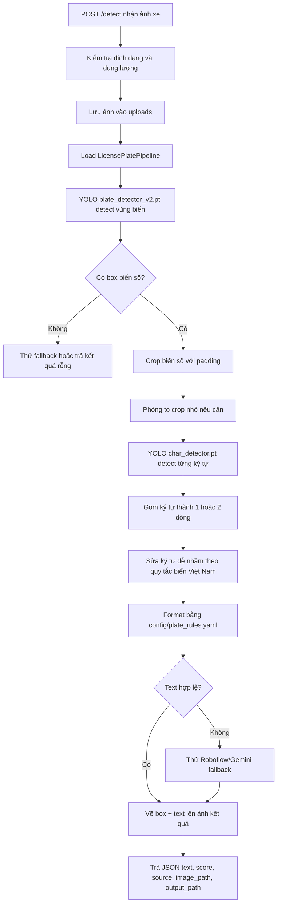

Quá trình xử lý chi tiết:

1. `api_server.py` nhận request, kiểm tra content-type, phần mở rộng ảnh và giới hạn dung lượng upload.
2. Ảnh được lưu bằng tên duy nhất trong thư mục `uploads/`.
3. `LicensePlatePipeline.process_image()` đọc ảnh bằng OpenCV.
4. Nếu ảnh upload có tên trùng với ảnh đã audit trong `input-not-detect/`, pipeline có thể dùng sidecar label `.txt` hoặc ground-truth đã có để hỗ trợ xử lý các hard-case.
5. `PlateDetector` chạy YOLO local với `models/plate_detector_v2.pt` để tìm bounding box vùng biển số. Kết quả trả về gồm `[x1, y1, x2, y2]` và confidence.
6. Pipeline crop vùng biển số bằng `crop_image(..., padding=10)` để lấy thêm viền quanh biển, tránh mất ký tự sát mép.
7. Nếu ảnh crop quá nhỏ, hàm `_preprocess_plate()` phóng to ảnh để ký tự rõ hơn trước khi OCR.
8. `YoloCharacterOCR` chạy `models/char_detector.pt` trên ảnh crop để detect từng ký tự. Mỗi ký tự có class, box, confidence, tâm `cx/cy`, chiều rộng và chiều cao.
9. `CharacterReader.group_chars_to_rows()` gom ký tự thành một dòng hoặc hai dòng dựa trên vị trí trục y và chiều cao trung bình của ký tự.
10. `CharacterReader.apply_vn_plate_corrections()` sửa các nhầm lẫn thường gặp như `3` thành `C` ở vị trí chữ, `O` thành `0` ở vị trí số, `8` thành `B` nếu thuộc vùng chữ.
11. `PlateFormatter` đọc `config/plate_rules.yaml` để format biển số, ví dụ `30A12345` thành `30A-12345` hoặc `89CD00213` thành `89CD-002.13`.
12. Nếu text rỗng, sai format hoặc confidence thấp, pipeline thử fallback Roboflow; nếu vẫn chưa đạt, thử final fallback Gemini.
13. API trả response gồm `success`, `text`, danh sách `plates`, `image_path`, `output_path` và log nếu bật cấu hình.

## 0.5. Vai trò của từng file Python chính

**Bảng 0.2. Các file Python chính trong chức năng detect biển số**

| File | Vai trò |
|---|---|
| `api_server.py` | HTTP API nhận ảnh từ backend, gọi pipeline OCR và trả JSON kết quả. |
| `run.py` | Script chạy thử nhanh trên một ảnh hoặc một thư mục ảnh khi phát triển. |
| `main.py` | CLI xử lý ảnh biển số với nhiều tham số cấu hình detector/OCR/fallback. |
| `src/pipeline.py` | Điều phối toàn bộ luồng: detect vùng biển, crop, OCR, fallback, format, vẽ kết quả. |
| `src/detector.py` | Bọc hai cách detect vùng biển: YOLO local hoặc Roboflow API. |
| `src/ocr_yolo.py` | OCR ký tự bằng YOLO local `char_detector.pt`. |
| `src/ocr_roboflow.py` | OCR ký tự bằng Roboflow API. |
| `src/ocr_gemini.py` | OCR fallback bằng Gemini Vision API. |
| `src/character_reader.py` | Gom ký tự theo dòng, sửa nhầm lẫn chữ/số và gọi formatter. |
| `src/plate_formatter.py` | Format chuỗi ký tự thành biển số Việt Nam theo rule YAML. |
| `config/plate_rules.yaml` | Cấu hình quy tắc format biển số, biển đặc biệt và ngưỡng chia dòng. |

Nhờ cách tổ chức này, hệ thống có thể thay thế từng phần độc lập. Nếu detector vùng biển chưa tốt, có thể bổ sung ảnh và train lại `plate_detector_v2.pt`. Nếu OCR ký tự nhầm nhiều, có thể bổ sung crop biển và train lại `char_detector.pt`. Nếu cả hai model local chưa xử lý được ảnh quá khó, Roboflow và Gemini vẫn đóng vai trò phương án dự phòng.

---

# CHƯƠNG 1. XÁC ĐỊNH YÊU CẦU

## 1.1. Giới thiệu sơ bộ

### 1.1.1. Địa điểm khảo sát

Đối tượng khảo sát là quy trình kiểm soát xe chở vật liệu ra vào tại công trường xây dựng. Trong phạm vi đề tài, hệ thống được mô phỏng cho một đơn vị thi công có nhiều công trình, mỗi công trình tiếp nhận vật tư từ nhiều nhà cung cấp khác nhau.

Các điểm cần quản lý tại công trường gồm:

- Cổng ra vào công trường, nơi bảo vệ hoặc nhân viên điều phối ghi nhận chuyến xe.
- Bộ phận vật tư, nơi lập kế hoạch nhập và kiểm tra khối lượng.
- Bộ phận quản lý, nơi theo dõi tổng hợp chi phí, số chuyến, vật tư và nhà cung cấp.

### 1.1.2. Quy mô hoạt động

Hệ thống hướng tới quy mô vừa và nhỏ, có thể áp dụng cho một hoặc nhiều công trình. Mỗi công trình có danh sách vật tư, kế hoạch nhập theo ngày, nhiều nhà cung cấp và nhiều chuyến xe phát sinh trong quá trình thi công.

Dữ liệu hiện có trong repo phục vụ thử nghiệm OCR gồm:

- Thư mục `input/`: 884 ảnh đầu vào.
- Thư mục `input-not-detect/`: 40 ảnh cần theo dõi/audit thêm.
- Thư mục `input-not-detect-2/`: 338 ảnh bổ sung cho nhóm ảnh khó.
- Dataset YOLO cho nhận diện vùng biển số và ký tự: 40 ảnh trong từng cấu hình train hiện tại.
- Model hiện có trong `models/`: `plate_detector.pt`, `plate_detector_v2.pt`, `char_detector.pt`.

### 1.1.3. Lĩnh vực hoạt động

Lĩnh vực hoạt động của hệ thống là quản lý nhập vật liệu xây dựng và kiểm soát xe ra vào công trường. Nghiệp vụ trọng tâm bao gồm:

- Quản lý thông tin công trình.
- Quản lý danh mục vật tư như cát, đá, xi măng, thép, bê tông, vật tư điện nước, vật tư hoàn thiện.
- Quản lý nhà cung cấp.
- Lập kế hoạch nhập vật tư theo công trình.
- Ghi nhận từng chuyến xe nhập vật tư.
- Nhận dạng biển số xe từ ảnh để giảm thao tác nhập tay.
- Tổng hợp báo cáo theo công trình, vật tư, nhà cung cấp và thời gian.

## 1.2. Mô tả bài toán

Tại công trường, mỗi chuyến xe chở vật liệu thường đi kèm các thông tin: công trình, loại vật tư, nhà cung cấp, khối lượng, đơn giá, thời điểm vào công trường, tài xế, loại xe, mã phiếu và biển số xe. Nếu ghi nhận thủ công, người dùng phải nhập toàn bộ thông tin, sau đó tổng hợp lại bằng bảng tính hoặc giấy tờ. Khi số lượng chuyến xe tăng, việc tìm kiếm, đối chiếu với kế hoạch nhập và thống kê chi phí trở nên khó khăn.

Hệ thống mới cần cho phép nhân viên nhập liệu chọn công trình, vật tư, nhà cung cấp, kế hoạch nhập tương ứng và tải ảnh xe vào hệ thống. Backend sẽ gửi ảnh sang Python OCR API. Dịch vụ OCR phát hiện vùng biển số, đọc ký tự, chuẩn hóa theo quy tắc biển số Việt Nam và trả kết quả cho backend. Nếu kết quả OCR hợp lệ, hệ thống tự điền biển số vào chuyến xe; nếu chưa chính xác, người dùng có thể chỉnh sửa trường biển số xác nhận.

Sau khi dữ liệu chuyến xe được lưu, quản lý có thể xem danh sách chuyến xe, lọc theo công trình, vật tư, nhà cung cấp, trạng thái hoặc khoảng thời gian. Hệ thống báo cáo tổng quan sẽ tính tổng số chuyến, tổng khối lượng, tổng chi phí, thống kê theo vật tư, theo nhà cung cấp và hiển thị các chuyến xe gần đây.

## 1.3. Yêu cầu chức năng và phi chức năng

### 1.3.1. Yêu cầu chức năng

**Bảng 1.1. Yêu cầu chức năng của hệ thống**

| STT | Chức năng | Mô tả |
|---:|---|---|
| 1 | Quản lý công trình | Thêm, sửa, xóa, tìm kiếm công trình; lưu mã, tên, địa điểm, chủ đầu tư, trạng thái, thời gian và ngân sách. |
| 2 | Quản lý vật tư | Thêm, sửa, xóa, tìm kiếm vật tư; lưu mã, tên, nhóm vật tư, đơn vị tính, đơn giá mặc định và trạng thái hoạt động. |
| 3 | Quản lý nhà cung cấp | Thêm, sửa, xóa, tìm kiếm nhà cung cấp; lưu mã, tên, mã số thuế, người liên hệ, điện thoại, email, địa chỉ. |
| 4 | Lập kế hoạch nhập vật liệu | Tạo kế hoạch nhập theo công trình, vật tư, nhà cung cấp, khối lượng, đơn giá, ngày dự kiến và trạng thái. |
| 5 | Ghi nhận chuyến xe | Lưu từng chuyến xe nhập vật liệu, khối lượng, đơn giá, thành tiền, thời gian, tài xế, loại xe, mã phiếu và trạng thái. |
| 6 | Nhận dạng biển số xe | Upload ảnh xe, gọi OCR API, nhận biển số, confidence, nguồn OCR, ảnh đầu vào và ảnh kết quả. |
| 7 | Xác nhận dữ liệu OCR | Cho phép người dùng sửa biển số xác nhận nếu OCR nhận sai hoặc thiếu. |
| 8 | Lọc và tra cứu | Lọc chuyến xe theo công trình, vật tư, nhà cung cấp, trạng thái và khoảng thời gian. |
| 9 | Báo cáo tổng quan | Thống kê số chuyến, tổng khối lượng, tổng chi phí, chi phí trung bình, thống kê theo vật tư/nhà cung cấp/ngày. |
| 10 | Kiểm tra trạng thái OCR | Hiển thị trạng thái OCR API online/offline trên giao diện frontend. |

### 1.3.2. Yêu cầu phi chức năng

**Bảng 1.2. Yêu cầu phi chức năng của hệ thống**

| STT | Nhóm yêu cầu | Mô tả |
|---:|---|---|
| 1 | Tính dễ sử dụng | Giao diện web rõ ràng, có menu điều hướng, bảng dữ liệu, bộ lọc và form nhập liệu thống nhất. |
| 2 | Tính chính xác | Dữ liệu chuyến xe phải tính đúng thành tiền theo công thức `quantity * unitPrice`; biển số OCR phải có cơ chế người dùng xác nhận. |
| 3 | Tính mở rộng | Backend chia module theo nghiệp vụ; có thể bổ sung phân quyền, phê duyệt, xuất báo cáo hoặc đồng bộ cân điện tử sau này. |
| 4 | Tính ổn định | Backend kiểm tra quan hệ công trình, vật tư, nhà cung cấp trước khi lưu chuyến xe; OCR API trả JSON lỗi rõ ràng. |
| 5 | Hiệu năng | React frontend tải dữ liệu song song; backend dùng truy vấn có điều kiện; OCR API cache pipeline và xử lý request bằng `ThreadingHTTPServer`. |
| 6 | Bảo mật | Cần cấu hình biến môi trường cho API key; production cần thêm xác thực, phân quyền và tắt `TYPEORM_SYNCHRONIZE`. |
| 7 | Khả năng triển khai | Có Docker Compose để chạy PostgreSQL, pgAdmin, Python OCR API, backend và frontend. |

## 1.4. Ưu nhược điểm của hệ thống cũ

### 1.4.1. Ưu điểm

Quy trình thủ công có ưu điểm là đơn giản, ít phụ thuộc vào hạ tầng kỹ thuật và có thể thực hiện ngay bằng giấy tờ hoặc bảng tính. Nhân viên công trường không cần đào tạo nhiều để ghi thông tin chuyến xe, vật tư và nhà cung cấp.

### 1.4.2. Nhược điểm

Tuy nhiên, khi số lượng chuyến xe lớn, cách làm thủ công bộc lộ nhiều hạn chế:

- Dễ sai biển số xe, thời gian, khối lượng hoặc đơn giá do nhập tay.
- Khó đối chiếu giữa kế hoạch nhập và số chuyến thực tế.
- Tốn thời gian tổng hợp báo cáo theo ngày, công trình, vật tư, nhà cung cấp.
- Thiếu ảnh chứng minh và thông tin OCR phục vụ kiểm toán.
- Không có trạng thái xử lý rõ ràng cho chuyến xe đang chờ xác nhận, đã xác nhận hoặc bị loại.

## 1.5. Dự kiến hệ thống mới

Hệ thống mới là một ứng dụng web quản lý nhập vật liệu công trường, kết hợp OCR biển số xe. Người dùng thao tác trên frontend React, backend NestJS xử lý nghiệp vụ và lưu dữ liệu vào PostgreSQL. Khi cần nhận dạng biển số, backend gọi Python OCR API. Dịch vụ OCR sử dụng pipeline nhận diện vùng biển số bằng YOLO, đọc ký tự bằng YOLO/Roboflow, fallback Gemini khi cần và chuẩn hóa kết quả theo quy tắc biển số Việt Nam.

Kiến trúc tổng quát:

```text
React + Ant Design
  -> NestJS Business API
      -> PostgreSQL
      -> Python Plate OCR API
          -> YOLO / Roboflow / Gemini OCR pipeline
```

## 1.6. Lập kế hoạch thực hiện

### 1.6.1. Tiến độ thực hiện

**Bảng 1.3. Kế hoạch thực hiện dự án**

| Giai đoạn | Nội dung | Kết quả |
|---|---|---|
| Tuần 1 | Khảo sát bài toán, xác định nghiệp vụ và dữ liệu cần quản lý | Danh sách tác nhân, UseCase, thực thể nghiệp vụ |
| Tuần 2 | Xây dựng pipeline OCR biển số | Script `run.py`, `main.py`, các module detector/OCR/formatter |
| Tuần 3 | Xây dựng Python OCR API và backend NestJS | Endpoint `/detect`, `/plates/detect`, CRUD nghiệp vụ |
| Tuần 4 | Xây dựng frontend React | Giao diện dashboard, danh mục, kế hoạch nhập, chuyến xe |
| Tuần 5 | Tích hợp Docker Compose, kiểm thử và hoàn thiện báo cáo | Tài liệu chạy hệ thống, báo cáo phân tích thiết kế |

**Hình 1.1. Lịch trình thực hiện dự án**

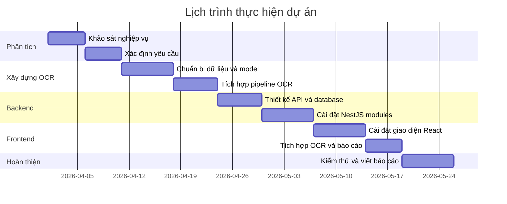

### 1.6.2. Mục tiêu

Mục tiêu của đề tài:

- Xây dựng hệ thống quản lý nhập vật liệu theo công trình.
- Chuẩn hóa dữ liệu vật tư, nhà cung cấp, kế hoạch nhập và chuyến xe.
- Tích hợp OCR biển số xe để giảm thao tác nhập tay.
- Lưu lại kết quả OCR, confidence và ảnh phục vụ đối soát.
- Cung cấp báo cáo tổng quan giúp quản lý nắm được khối lượng và chi phí.
- Có khả năng chạy local hoặc Docker Compose để thuận tiện triển khai.

### 1.6.3. Công cụ sử dụng

**Bảng 1.4. Công cụ sử dụng**

| Nhóm | Công cụ |
|---|---|
| Ngôn ngữ | TypeScript, Python |
| Frontend | React 19, Vite, Ant Design, Axios, Dayjs |
| Backend | NestJS 10, TypeORM, class-validator, Axios, FormData |
| Cơ sở dữ liệu | PostgreSQL 16, pgAdmin |
| OCR/AI | YOLOv8, OpenCV, Roboflow API, Gemini Vision fallback |
| Triển khai | Docker, Docker Compose |
| Quản lý mã nguồn | Git |
| IDE | Visual Studio Code |

---

# CHƯƠNG 2. PHÂN TÍCH HỆ THỐNG

## 2.1. Phân tích hệ thống về chức năng

### 2.1.1. Xác định tác nhân và UseCase

**Bảng 2.1. Xác định tác nhân và UseCase**

| Tác nhân | Vai trò | UseCase tác động |
|---|---|---|
| Nhân viên công trường | Ghi nhận xe và dữ liệu vật liệu vào công trường | Ghi nhận chuyến xe, upload ảnh OCR, chỉnh sửa biển số, lọc danh sách chuyến |
| Nhân viên vật tư | Quản lý danh mục và kế hoạch nhập | Quản lý vật tư, nhà cung cấp, kế hoạch nhập vật liệu |
| Quản lý công trình | Theo dõi dữ liệu nhập vật liệu và chi phí | Quản lý công trình, xem báo cáo tổng quan, kiểm tra trạng thái chuyến xe |
| Dịch vụ OCR | Tự động nhận dạng biển số từ ảnh | Detect biển số, trả text, confidence, ảnh kết quả và payload OCR |
| Quản trị hệ thống | Vận hành hạ tầng phần mềm | Cấu hình API key, Docker Compose, PostgreSQL, kiểm tra health |

### 2.1.2. UseCase tổng quát

**Hình 2.1. UseCase tổng quát hệ thống**

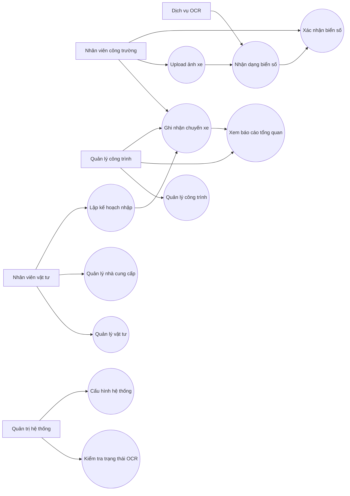

### 2.1.3. Danh sách và đặc tả UseCase

#### a. UseCase quản lý công trình

**Bảng 2.2. Đặc tả UseCase quản lý công trình**

| STT | Mục | Nội dung |
|---:|---|---|
| 1 | Tên UseCase | Quản lý công trình |
| 2 | Actor | Quản lý công trình |
| 3 | Điều kiện | Backend và cơ sở dữ liệu hoạt động bình thường |
| 4 | Mô tả | Cho phép thêm, sửa, xóa, tìm kiếm và xem danh sách công trình |
| 5 | Luồng chính | Người dùng mở màn hình Công trình, nhập thông tin, bấm lưu; hệ thống gọi API `/projects` và cập nhật danh sách |
| 6 | Luồng phụ | Nếu mã công trình trùng hoặc thiếu dữ liệu bắt buộc, backend trả lỗi và frontend hiển thị thông báo |
| 7 | Kết quả | Dữ liệu công trình được lưu trong bảng `projects` |

#### b. UseCase quản lý vật tư

**Bảng 2.3. Đặc tả UseCase quản lý vật tư**

| STT | Mục | Nội dung |
|---:|---|---|
| 1 | Tên UseCase | Quản lý vật tư |
| 2 | Actor | Nhân viên vật tư |
| 3 | Điều kiện | Người dùng có quyền thao tác danh mục vật tư |
| 4 | Mô tả | Quản lý mã vật tư, tên vật tư, nhóm, đơn vị tính, đơn giá mặc định và trạng thái |
| 5 | Luồng chính | Người dùng thêm/sửa/xóa vật tư; frontend gọi các API `/materials` |
| 6 | Luồng phụ | Nếu vật tư đang được dùng trong kế hoạch hoặc chuyến xe, hệ thống cần hạn chế xóa để bảo toàn dữ liệu |
| 7 | Kết quả | Dữ liệu vật tư được dùng làm tham chiếu cho kế hoạch nhập và chuyến xe |

#### c. UseCase quản lý nhà cung cấp

**Bảng 2.4. Đặc tả UseCase quản lý nhà cung cấp**

| STT | Mục | Nội dung |
|---:|---|---|
| 1 | Tên UseCase | Quản lý nhà cung cấp |
| 2 | Actor | Nhân viên vật tư |
| 3 | Điều kiện | Backend kết nối được PostgreSQL |
| 4 | Mô tả | Lưu thông tin nhà cung cấp vật liệu, người liên hệ và trạng thái hoạt động |
| 5 | Luồng chính | Người dùng nhập mã, tên, mã số thuế, thông tin liên hệ; hệ thống lưu vào bảng `suppliers` |
| 6 | Luồng phụ | Nếu thiếu mã/tên hoặc mã bị trùng, hệ thống từ chối lưu |
| 7 | Kết quả | Nhà cung cấp sẵn sàng để gắn vào kế hoạch nhập và chuyến xe |

#### d. UseCase lập kế hoạch nhập vật liệu

**Bảng 2.5. Đặc tả UseCase lập kế hoạch nhập vật liệu**

| STT | Mục | Nội dung |
|---:|---|---|
| 1 | Tên UseCase | Lập kế hoạch nhập vật liệu |
| 2 | Actor | Nhân viên vật tư, quản lý công trình |
| 3 | Điều kiện | Đã có công trình, vật tư và có thể chọn nhà cung cấp |
| 4 | Mô tả | Tạo kế hoạch nhập theo công trình, vật tư, nhà cung cấp, khối lượng, đơn giá và ngày dự kiến |
| 5 | Luồng chính | Người dùng nhập kế hoạch; backend kiểm tra khóa ngoại và lưu bảng `import_plans` |
| 6 | Luồng phụ | Có thể thay đổi trạng thái kế hoạch: planned, partial, completed, cancelled |
| 7 | Kết quả | Kế hoạch nhập được dùng để đối chiếu với chuyến xe thực tế |

#### e. UseCase ghi nhận chuyến xe

**Bảng 2.6. Đặc tả UseCase ghi nhận chuyến xe**

| STT | Mục | Nội dung |
|---:|---|---|
| 1 | Tên UseCase | Ghi nhận chuyến xe |
| 2 | Actor | Nhân viên công trường |
| 3 | Điều kiện | Đã có công trình, vật tư, nhà cung cấp |
| 4 | Mô tả | Ghi nhận từng chuyến xe nhập vật liệu vào công trường |
| 5 | Luồng chính | Người dùng chọn thông tin nghiệp vụ, nhập khối lượng, đơn giá, thời gian, upload ảnh nếu có; hệ thống lưu vào `material_trips` |
| 6 | Luồng phụ | Nếu có ảnh, backend gọi OCR trước khi tạo bản ghi; nếu OCR lỗi, người dùng có thể nhập biển số thủ công |
| 7 | Kết quả | Chuyến xe được lưu với trạng thái pending/verified/rejected và tổng tiền tự tính |

#### f. UseCase nhận dạng biển số xe

**Bảng 2.7. Đặc tả UseCase nhận dạng biển số xe**

| STT | Mục | Nội dung |
|---:|---|---|
| 1 | Tên UseCase | Nhận dạng biển số xe |
| 2 | Actor | Dịch vụ OCR, nhân viên công trường |
| 3 | Điều kiện | OCR API hoạt động; ảnh upload thuộc định dạng jpg, jpeg, png, bmp hoặc webp |
| 4 | Mô tả | Nhận ảnh xe, phát hiện vùng biển số, OCR ký tự, chuẩn hóa text và trả kết quả |
| 5 | Luồng chính | Frontend gửi ảnh, NestJS proxy ảnh sang Python API `/detect`, OCR API trả JSON, backend lưu payload |
| 6 | Luồng phụ | Nếu OCR chính thất bại, pipeline thử fallback Roboflow hoặc Gemini tùy cấu hình |
| 7 | Kết quả | Biển số detect được, confidence, nguồn OCR, ảnh đầu vào và ảnh kết quả được lưu |

#### g. UseCase xem báo cáo tổng quan

**Bảng 2.8. Đặc tả UseCase xem báo cáo tổng quan**

| STT | Mục | Nội dung |
|---:|---|---|
| 1 | Tên UseCase | Xem báo cáo tổng quan |
| 2 | Actor | Quản lý công trình |
| 3 | Điều kiện | Có dữ liệu chuyến xe trong hệ thống |
| 4 | Mô tả | Tổng hợp số chuyến, khối lượng, chi phí theo bộ lọc |
| 5 | Luồng chính | Người dùng chọn công trình và khoảng ngày; frontend gọi `/reports/overview`; backend trả dữ liệu tổng hợp |
| 6 | Luồng phụ | Nếu không có chuyến xe phù hợp, hệ thống trả số liệu 0 và bảng rỗng |
| 7 | Kết quả | Quản lý nắm được chi phí và khối lượng nhập vật liệu |

## 2.2. Phân tích hệ thống về hành vi

### 2.2.1. Biểu đồ trình tự

#### 2.2.1.1. Ghi nhận chuyến xe có OCR

**Hình 2.2. Biểu đồ trình tự ghi nhận chuyến xe có OCR**

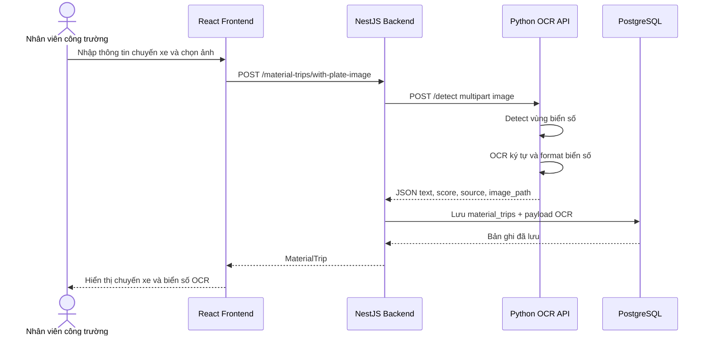

#### 2.2.1.2. Quản lý danh mục

**Hình 2.3. Biểu đồ trình tự quản lý danh mục**

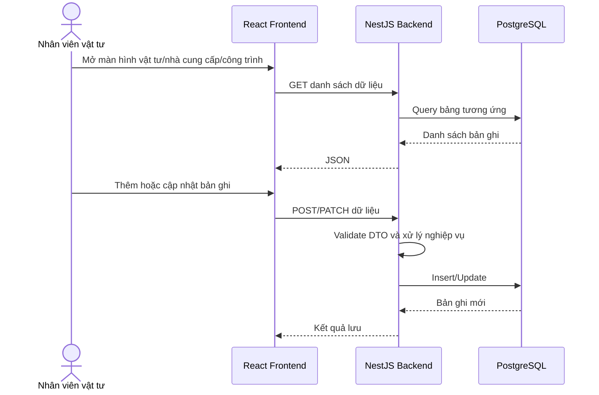

#### 2.2.1.3. Xem báo cáo tổng quan

**Hình 2.4. Biểu đồ trình tự xem báo cáo tổng quan**

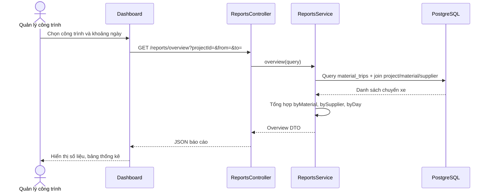

### 2.2.2. Biểu đồ hoạt động

#### 2.2.2.1. Hoạt động ghi nhận chuyến xe

**Hình 2.5. Biểu đồ hoạt động ghi nhận chuyến xe**

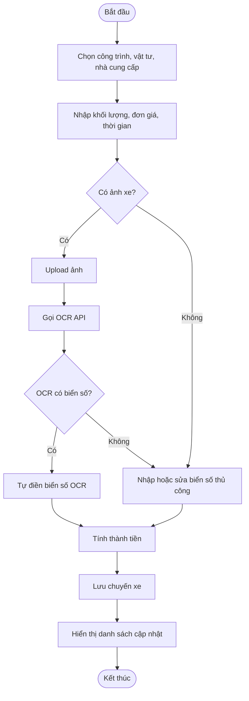

#### 2.2.2.2. Hoạt động kiểm tra và xác nhận OCR

**Hình 2.6. Biểu đồ hoạt động kiểm tra và xác nhận OCR**

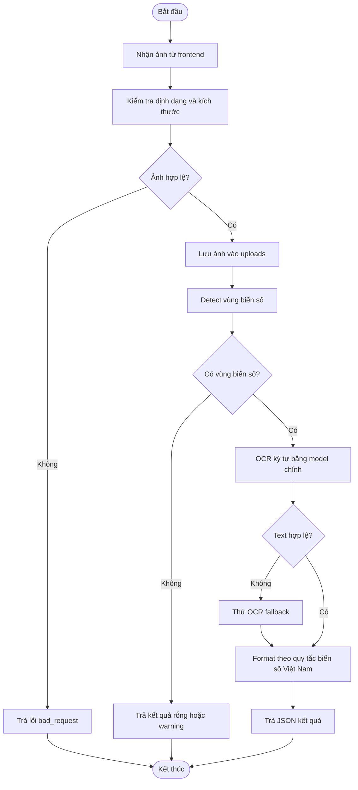

### 2.2.3. Biểu đồ trạng thái

**Hình 2.7. Biểu đồ trạng thái chuyến xe vật liệu**

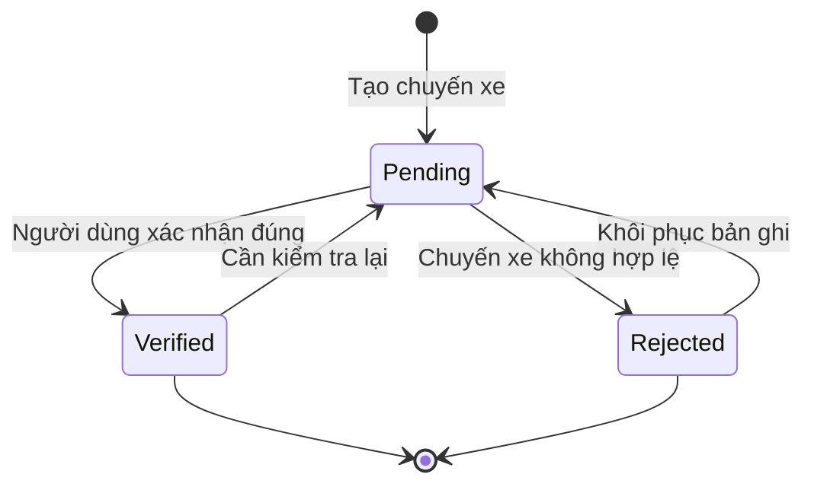

## 2.3. Phân tích lớp và dữ liệu

### 2.3.1. Danh sách lớp thực thể

**Bảng 2.9. Danh sách lớp thực thể**

| Lớp | Vai trò | Bảng tương ứng |
|---|---|---|
| Project | Lưu thông tin công trình | `projects` |
| Material | Lưu danh mục vật tư | `materials` |
| Supplier | Lưu thông tin nhà cung cấp | `suppliers` |
| ImportPlan | Lưu kế hoạch nhập vật liệu | `import_plans` |
| MaterialTrip | Lưu từng chuyến xe nhập vật liệu và dữ liệu OCR | `material_trips` |
| PlateOcrService | Proxy từ NestJS sang Python OCR API | Không lưu bảng riêng |
| ReportsService | Tổng hợp báo cáo từ chuyến xe | Không lưu bảng riêng |

### 2.3.2. Biểu đồ lớp

**Hình 2.8. Biểu đồ lớp nghiệp vụ chính**

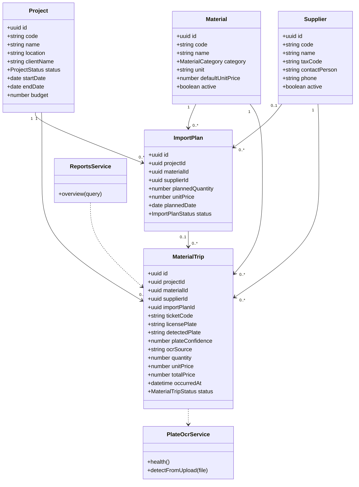

---

# CHƯƠNG 3. THIẾT KẾ CHI TIẾT

## 3.1. Thiết kế tổng thể

### 3.1.1. Biểu đồ triển khai

**Hình 3.1. Biểu đồ triển khai hệ thống**

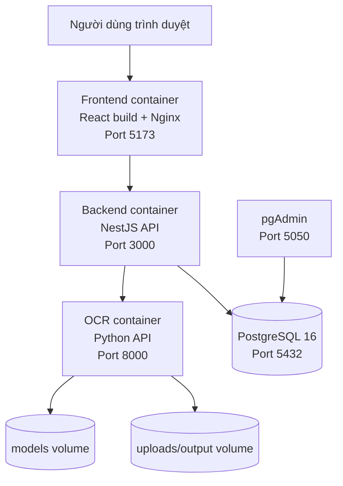

### 3.1.2. Biểu đồ thành phần

**Hình 3.2. Biểu đồ thành phần hệ thống**

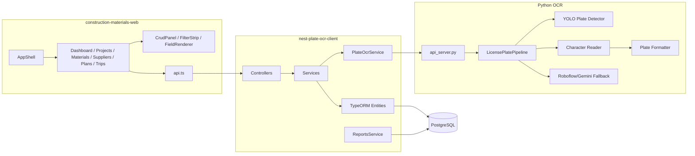

## 3.2. Thiết kế chi tiết

### 3.2.1. Thiết kế cấu trúc bảng

#### a. Bảng `projects`

**Bảng 3.1. Thiết kế bảng projects**

| Thuộc tính | Kiểu dữ liệu | Ràng buộc | Ý nghĩa |
|---|---|---|---|
| id | uuid | Khóa chính | Mã định danh công trình |
| code | varchar | Unique, not null | Mã công trình |
| name | varchar | Not null | Tên công trình |
| location | varchar | Nullable | Địa điểm |
| clientName | varchar | Nullable | Chủ đầu tư/khách hàng |
| status | varchar | Default `active` | Trạng thái: active, paused, completed |
| startDate | date | Nullable | Ngày bắt đầu |
| endDate | date | Nullable | Ngày kết thúc |
| budget | double precision | Default 0 | Ngân sách |
| createdAt | timestamp | Auto | Thời điểm tạo |
| updatedAt | timestamp | Auto | Thời điểm cập nhật |

#### b. Bảng `materials`

**Bảng 3.2. Thiết kế bảng materials**

| Thuộc tính | Kiểu dữ liệu | Ràng buộc | Ý nghĩa |
|---|---|---|---|
| id | uuid | Khóa chính | Mã định danh vật tư |
| code | varchar | Unique, not null | Mã vật tư |
| name | varchar | Not null | Tên vật tư |
| category | varchar | Default `other` | Nhóm vật tư |
| unit | varchar | Default `kg` | Đơn vị tính |
| defaultUnitPrice | double precision | Default 0 | Đơn giá mặc định |
| active | boolean | Default true | Trạng thái sử dụng |
| description | text | Nullable | Mô tả |
| createdAt | timestamp | Auto | Thời điểm tạo |
| updatedAt | timestamp | Auto | Thời điểm cập nhật |

#### c. Bảng `suppliers`

**Bảng 3.3. Thiết kế bảng suppliers**

| Thuộc tính | Kiểu dữ liệu | Ràng buộc | Ý nghĩa |
|---|---|---|---|
| id | uuid | Khóa chính | Mã định danh nhà cung cấp |
| code | varchar | Unique, not null | Mã nhà cung cấp |
| name | varchar | Not null | Tên nhà cung cấp |
| taxCode | varchar | Nullable | Mã số thuế |
| contactPerson | varchar | Nullable | Người liên hệ |
| phone | varchar | Nullable | Số điện thoại |
| email | varchar | Nullable | Email |
| address | varchar | Nullable | Địa chỉ |
| active | boolean | Default true | Trạng thái hoạt động |
| note | text | Nullable | Ghi chú |
| createdAt | timestamp | Auto | Thời điểm tạo |
| updatedAt | timestamp | Auto | Thời điểm cập nhật |

#### d. Bảng `import_plans`

**Bảng 3.4. Thiết kế bảng import_plans**

| Thuộc tính | Kiểu dữ liệu | Ràng buộc | Ý nghĩa |
|---|---|---|---|
| id | uuid | Khóa chính | Mã định danh kế hoạch |
| projectId | uuid | FK projects | Công trình |
| materialId | uuid | FK materials | Vật tư |
| supplierId | uuid | FK suppliers, nullable | Nhà cung cấp dự kiến |
| plannedQuantity | double precision | Default 0 | Khối lượng dự kiến |
| unitPrice | double precision | Default 0 | Đơn giá dự kiến |
| plannedDate | date | Nullable | Ngày dự kiến nhập |
| status | varchar | Default `planned` | planned, partial, completed, cancelled |
| note | text | Nullable | Ghi chú |
| createdAt | timestamp | Auto | Thời điểm tạo |
| updatedAt | timestamp | Auto | Thời điểm cập nhật |

#### e. Bảng `material_trips`

**Bảng 3.5. Thiết kế bảng material_trips**

| Thuộc tính | Kiểu dữ liệu | Ràng buộc | Ý nghĩa |
|---|---|---|---|
| id | uuid | Khóa chính | Mã định danh chuyến xe |
| projectId | uuid | FK projects | Công trình |
| materialId | uuid | FK materials | Vật tư nhập |
| supplierId | uuid | FK suppliers | Nhà cung cấp |
| importPlanId | uuid | FK import_plans, nullable | Kế hoạch liên quan |
| ticketCode | varchar | Nullable | Mã phiếu/chứng từ |
| driverName | varchar | Nullable | Tên tài xế |
| vehicleType | varchar | Nullable | Loại xe |
| licensePlate | varchar | Nullable | Biển số đã xác nhận |
| detectedPlate | varchar | Nullable | Biển số OCR đọc được |
| plateConfidence | double precision | Nullable | Confidence OCR/detector |
| ocrSource | varchar | Nullable | Nguồn OCR |
| ocrImagePath | varchar | Nullable | Đường dẫn ảnh upload |
| ocrOutputPath | varchar | Nullable | Đường dẫn ảnh kết quả |
| ocrPayload | jsonb | Nullable | Response OCR gốc để audit |
| quantity | double precision | Default 0 | Khối lượng thực nhập |
| unitPrice | double precision | Default 0 | Đơn giá |
| totalPrice | double precision | Default 0 | Thành tiền |
| occurredAt | timestamptz | Not null | Thời điểm vào công trường |
| status | varchar | Default `pending` | pending, verified, rejected |
| note | text | Nullable | Ghi chú |
| createdAt | timestamp | Auto | Thời điểm tạo |
| updatedAt | timestamp | Auto | Thời điểm cập nhật |

### 3.2.2. Thiết kế cơ sở dữ liệu vật lý

**Hình 3.3. Sơ đồ cơ sở dữ liệu vật lý**

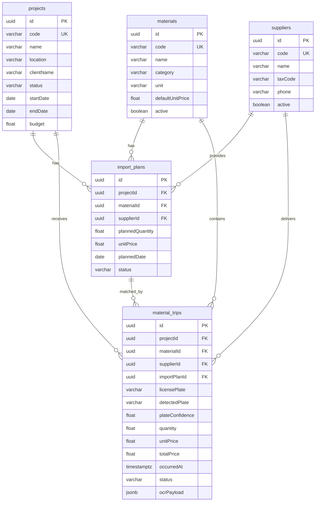

## 3.3. Thiết kế giao diện

Giao diện được xây dựng bằng React, Vite và Ant Design. Bố cục chính gồm sidebar điều hướng bên trái và vùng nội dung bên phải. Các màn hình có cấu trúc thống nhất: tiêu đề, mô tả ngắn, nút làm mới, nút thêm mới, bộ lọc và bảng dữ liệu.

### 3.3.1. Màn hình tổng quan

Màn hình tổng quan hiển thị:

- Bộ lọc công trình và khoảng ngày.
- Số chuyến xe.
- Tổng khối lượng.
- Tổng chi phí.
- Bảng thống kê theo vật tư.
- Bảng thống kê theo nhà cung cấp.
- Danh sách chuyến xe gần đây.

### 3.3.2. Màn hình công trình, vật tư, nhà cung cấp

Các màn hình danh mục dùng chung component `CrudPanel`. Component này nhận cấu hình cột, cấu hình field form và các hàm API tương ứng để tái sử dụng cho nhiều loại dữ liệu. Người dùng có thể thêm mới, cập nhật, xóa bản ghi và lọc/tìm kiếm.

### 3.3.3. Màn hình kế hoạch nhập

Màn hình kế hoạch nhập cho phép tạo kế hoạch theo công trình, vật tư và nhà cung cấp. Người dùng nhập khối lượng dự kiến, đơn giá, ngày dự kiến và trạng thái kế hoạch. Dữ liệu này giúp đối chiếu với các chuyến xe thực tế sau này.

### 3.3.4. Màn hình chuyến xe

Màn hình chuyến xe là phần nghiệp vụ trọng tâm. Người dùng chọn công trình, vật tư, nhà cung cấp, kế hoạch, nhập mã phiếu, thời gian, khối lượng, đơn giá, tài xế, loại xe và trạng thái. Khi chọn ảnh xe, hệ thống gọi OCR để tự động đọc biển số. Kết quả OCR hiển thị kèm confidence và nguồn OCR; người dùng có thể chỉnh sửa biển số xác nhận trước khi lưu.

## 3.4. Thiết kế chương trình

### 3.4.1. Danh sách module

**Bảng 3.7. Danh sách module chương trình**

| Thành phần | Module/File chính | Chức năng |
|---|---|---|
| Frontend | `construction-materials-web/src/App.tsx` | Bố cục ứng dụng, sidebar, điều hướng, theme Ant Design |
| Frontend | `src/api.ts` | Khai báo client Axios và các hàm gọi API |
| Frontend | `src/components/CrudPanel.tsx` | Component CRUD dùng chung |
| Frontend | `src/pages/DashboardPage.tsx` | Báo cáo tổng quan |
| Frontend | `src/pages/MaterialTripsPage.tsx` | Quản lý chuyến xe và upload OCR |
| Frontend | `src/viewModels/*` | Tách logic tải dữ liệu, lọc, form, OCR khỏi component |
| Backend | `projects`, `materials`, `suppliers` | CRUD danh mục |
| Backend | `import-plans` | Quản lý kế hoạch nhập |
| Backend | `material-trips` | Quản lý chuyến xe và lưu dữ liệu OCR |
| Backend | `plate-ocr` | Proxy ảnh sang Python OCR API |
| Backend | `reports` | Tổng hợp báo cáo |
| OCR API | `api_server.py` | HTTP API `/health`, `/detect` |
| OCR Core | `src/pipeline.py` | Pipeline detect + OCR + fallback |
| OCR Core | `src/plate_formatter.py` | Chuẩn hóa format biển số Việt Nam |
| OCR Core | `src/character_reader.py` | Sắp xếp ký tự, sửa nhầm lẫn OCR |

### 3.4.2. Danh sách API chính

**Bảng 3.6. Danh sách API chính**

| Nhóm | Endpoint | Chức năng |
|---|---|---|
| OCR | `GET /plates/health` | Backend kiểm tra Python OCR API |
| OCR | `POST /plates/detect` | Upload ảnh và nhận biển số |
| Công trình | `GET/POST/PATCH/DELETE /projects` | CRUD công trình |
| Vật tư | `GET/POST/PATCH/DELETE /materials` | CRUD vật tư |
| Nhà cung cấp | `GET/POST/PATCH/DELETE /suppliers` | CRUD nhà cung cấp |
| Kế hoạch | `GET/POST/PATCH/DELETE /import-plans` | CRUD kế hoạch nhập |
| Chuyến xe | `GET/POST/PATCH/DELETE /material-trips` | CRUD chuyến xe |
| Chuyến xe + OCR | `POST /material-trips/with-plate-image` | Tạo chuyến xe kèm ảnh OCR |
| OCR lại chuyến xe | `POST /material-trips/:id/plate-detect` | Detect lại biển số cho chuyến xe đã có |
| Báo cáo | `GET /reports/overview` | Tổng hợp báo cáo |

### 3.4.3. Luồng xử lý OCR biển số

**Hình 3.4. Luồng xử lý OCR biển số xe**

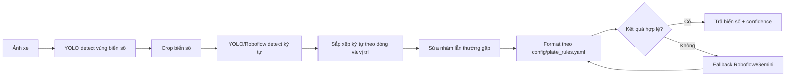

Các quy tắc format biển số được cấu hình trong `config/plate_rules.yaml`, gồm:

- Biển số đặc biệt có seri hai chữ cái như `89CD-002.13`.
- Trường hợp OCR nhận thừa số 0 ở cụm số đặc biệt.
- Biển số ô tô một dòng dạng `30AB-12345`.
- Biển số hai dòng, tách phần đầu và phần số bằng dấu gạch ngang.
- Fallback giữ nguyên chuỗi thô nếu không khớp quy tắc.

### 3.4.4. Thiết kế kiểm soát

#### 3.4.4.1. Kiểm soát dữ liệu

Hệ thống kiểm soát dữ liệu ở nhiều lớp:

- Frontend dùng form Ant Design để bắt buộc các trường quan trọng như công trình, vật tư, nhà cung cấp, khối lượng và thời gian.
- Backend dùng `class-validator` để kiểm tra UUID, số không âm, trạng thái hợp lệ và kiểu dữ liệu.
- Service kiểm tra công trình, vật tư, nhà cung cấp, kế hoạch có tồn tại trước khi lưu chuyến xe.
- Thành tiền được backend tính lại từ khối lượng và đơn giá, không phụ thuộc hoàn toàn vào frontend.
- Dữ liệu OCR gốc được lưu trong `ocrPayload` để có thể audit lại khi cần.

#### 3.4.4.2. Bảo mật an toàn thông tin

Trong bản hiện tại, hệ thống phục vụ mục tiêu demo/học tập nên chưa có xác thực người dùng. Khi triển khai thực tế cần bổ sung:

- Đăng nhập bằng JWT/session.
- Phân quyền nhân viên công trường, nhân viên vật tư, quản lý và quản trị hệ thống.
- Ẩn API key Roboflow/Gemini trong biến môi trường.
- Tắt `TYPEORM_SYNCHRONIZE` ở production và dùng migration.
- Giới hạn dung lượng upload, loại file và lưu ảnh vào volume/object storage riêng.
- Ghi log thao tác thêm/sửa/xóa dữ liệu quan trọng.

## 3.5. Triển khai và vận hành

### 3.5.1. Chạy bằng Docker Compose

Từ root project:

```powershell
docker compose up --build
```

Các dịch vụ chính:

| Dịch vụ | Địa chỉ |
|---|---|
| Frontend | `http://localhost:5173` |
| Backend | `http://localhost:3000` |
| Python OCR API | `http://localhost:8000` |
| pgAdmin | `http://localhost:5050` |
| PostgreSQL | `localhost:5432` |

### 3.5.2. Chạy local để phát triển

Chạy PostgreSQL/pgAdmin:

```powershell
docker compose up postgres pgadmin
```

Chạy Python OCR API:

```powershell
py api_server.py --host 127.0.0.1 --port 8000
```

Chạy backend:

```powershell
cd nest-plate-ocr-client
npm install
npm run start:dev
```

Chạy frontend:

```powershell
cd construction-materials-web
npm install
npm run dev
```

### 3.5.3. Kiểm thử

Repo hiện có kiểm thử cho phần format biển số tại `tests/test_plate_formatter.py`. Các ca kiểm thử tập trung vào:

- Format biển số đặc biệt như `89CD-002.13`.
- Format biển số có seri hai chữ cái như `80LD-123.45`, `80NN-123.45`.
- Sửa trường hợp OCR nhận thừa số 0.
- Giữ format biển số dân dụng hai chữ cái.
- Sửa nhầm lẫn ký tự trong vị trí chữ cái.
- Khôi phục kết quả bằng cách bỏ ký tự có confidence thấp.

Lệnh chạy kiểm thử:

```powershell
pytest tests/test_plate_formatter.py
```

---

# KẾT LUẬN

Sau quá trình phân tích và xây dựng, đề tài đã hình thành một hệ thống quản lý nhập vật liệu công trường có đầy đủ các thành phần chính: frontend React, backend NestJS, cơ sở dữ liệu PostgreSQL và Python OCR API. Hệ thống hỗ trợ quản lý công trình, vật tư, nhà cung cấp, kế hoạch nhập, chuyến xe vật liệu và báo cáo tổng quan.

Điểm nổi bật của hệ thống là tích hợp nhận dạng biển số xe từ ảnh. Pipeline OCR sử dụng YOLO để phát hiện vùng biển số, nhận dạng ký tự bằng YOLO/Roboflow, có fallback Gemini và chuẩn hóa định dạng theo quy tắc biển số Việt Nam. Việc lưu cả biển số OCR, biển số xác nhận, confidence, nguồn OCR và payload gốc giúp dữ liệu có khả năng kiểm tra lại, phù hợp với yêu cầu quản lý xe ra vào công trường.

Tuy nhiên, hệ thống vẫn còn một số hướng phát triển:

- Bổ sung đăng nhập, phân quyền và nhật ký thao tác.
- Thêm chức năng xuất báo cáo Excel/PDF.
- Bổ sung màn hình đối chiếu kế hoạch nhập với lượng nhập thực tế.
- Cải thiện độ chính xác OCR bằng cách mở rộng dataset và train thêm trên nhóm ảnh khó.
- Tích hợp cân điện tử hoặc thiết bị cổng kiểm soát nếu triển khai thực tế.

Nhìn chung, đề tài đáp ứng được mục tiêu xây dựng một ứng dụng quản lý vật liệu công trường có tính thực tiễn, có kiến trúc rõ ràng và có thể tiếp tục mở rộng cho môi trường vận hành thật.
